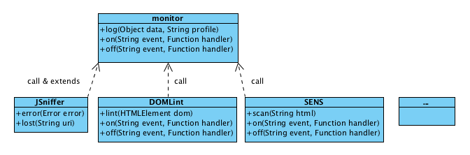

# monitor

---

通用前端监控采集脚本。

整体上，前端监控包含很多方面，例如包括：

* JavaScript 异常监控
* 敏感信息监控
* DOM 合法性检查
* 静态资源监控
* 网站监控等

为了更好的支持扩展性，和结构上的简单清晰，前端监控脚本提供了核心的数据采集方案，
提供了底层的数据交换接口。其他上层的监控模块负责各自独立的监控逻辑，并通过这个
底层的接口传输监控数据。

大致结构如下图：



从上图看，前端监控(monitor 模块)提供了核心的 `log()` 接口，
和 `on()`, `off()` 事件机制，其中 `log()` 方法提供了核心的可扩展数据传输接口，
`on()`, `off()` 事件机制提供了简单易用的扩展能力。

JSniffer 模块提供了全局的 JavaScript 异常监控支持，并扩展了 `error()` 方法。
为开发者监控主动捕获的异常做支持。

同时还扩展了 `lost()` 方法，在外部模块或资源加载失败时调用 `lost()` 方法，
监控到 JavaScript 异常时，附加这些缺失的资源信息，辅助异常分析。

JavaScript 异常是前端监控中最重要、最常用的信息，同时为了简化 API，所以将
这两个接口扩展附加在 monitor 模块上。

其他的 DOMLint, SENS 等第三方独立的监控模块，都直接调用 `monitor.log()` 接口
传输数据。


## 安装

前端监控脚本拆分为两个部分：

* seer.js

    小巧的先行脚本建议内联（也可以外联）在页面头部，在所有脚本和外部资源之前。
    用于收集全局的异常，并为后续业务准备好可用的 API。

* monitor.js

    后置监控模块（这是一个 CMD 模块）可以通过异步方式加载在页面底部，
    用于处理监控日志的发送和其他扩展支持。


```html
<html>
  <head>
    <meta charset="utf-8" />
    <script type="text/javascript" src="dist/seer.js"></script>
  </head>
  <body>

  page content...

  <script type="text/javascript">
  seajs.use("monitor", function(monitor){
  });
  </script>
  </body>
</html>
```


## 使用说明

一般情况下，JavaScript 异常监控前置脚本已经自动收集了页面上抛出的异常，
但也有部分场景，业务逻辑中 catch 捕获住了抛出 JavaScript 异常，避免影响后续
的业务逻辑，但同时希望监控到这个异常场景，可以主动调用 `monitor.error()` 接口：

```javascript
try{
  throw new Error("msg");
}catch(ex){
  monitor.error(ex);
}
```


## API


### monitor.error(Error error)

JavaScript 异常监控的接口，可以用于主动监控被捕获的 JavaScript 异常。


### monitor.log(Object seed [, String profile])

前端监控的通用频次监控接口。通过这个发送监控数据，并配合对应的日志处理和数据分析，
可以完成多种监控需求。

* `seed`: 详情数据，可以是简单的字符串，或者 `key: value` 键值对对象。
* `profile`: 日志类型，默认为 `log`。


### monitor.on(String eventName, Function handler)

监控到特定类型的数据时，会触发的特定事件。内置支持的事件类型包括：

* `*`: 发送所有类型的数据都会触发。
* `jserror`: 发送 JavaScript 异常数据前触发。
* `log`: 发送自定义 log 监控数据会触发。
* 其他任意的自定义类型类似。


### monitor.off(String eventName [, Function handler])

取消通过 on 绑定的事件。


### monitor.lost(String uri)

页面加载特定资源失败时，可以调用这个方法。
缺失的资源对于异常分析有较大帮助。

范例：

```html
<script src="sea.js" onerror="window.monitor && monitor.lost && monitor.lost(this.src)"></script>
<script>
// seajs 2.1 开始支持，但 error 事件仍有缺陷，seajs 2.2 的 error 事件较适合本场景。
seajs.on("error", function(module){
  window.monitor && monitor.lost && monitor.lost(module.uri);
});
</script>
```
